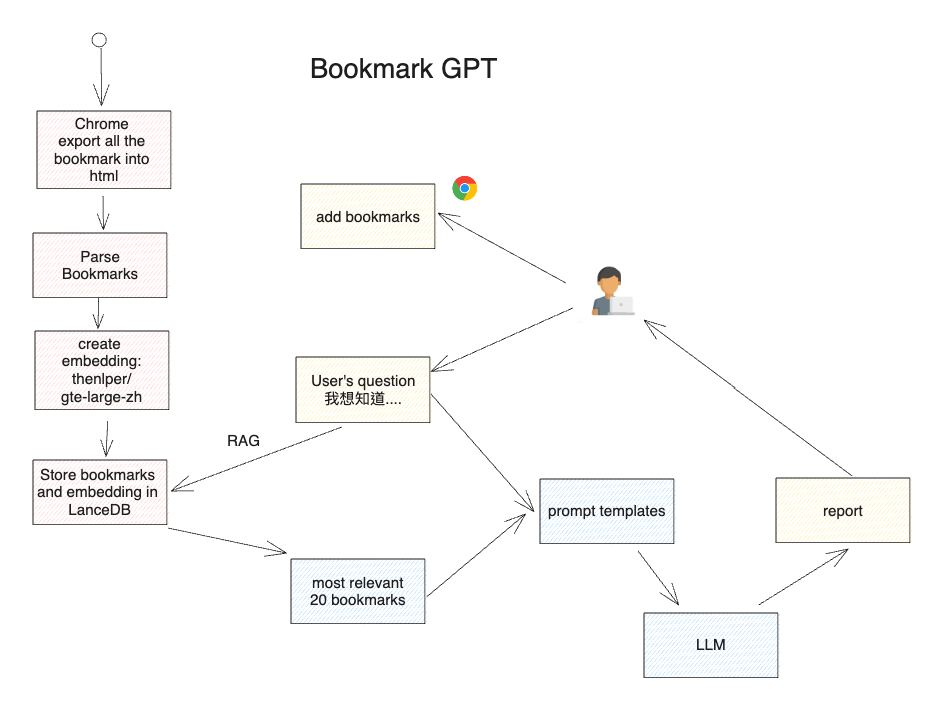
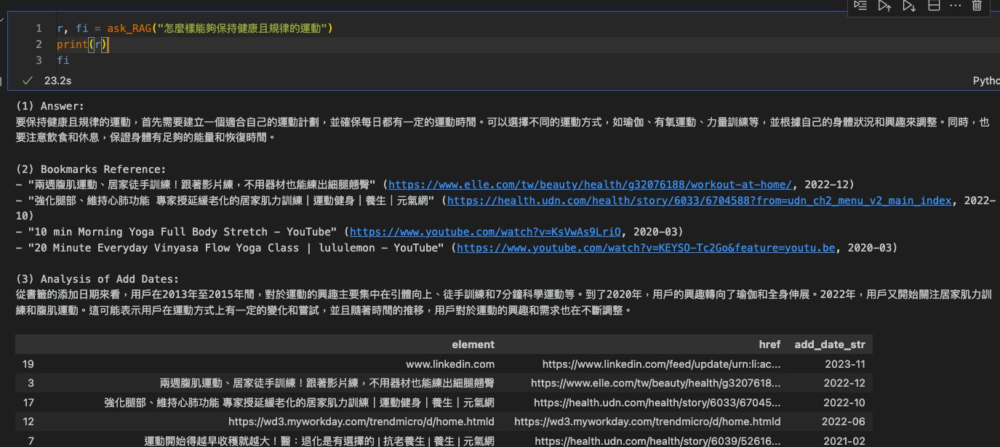

# BookmarkGPT

You will never felt guity after you add so many bookmarks but never read them again!
A GPT project practice RAG, embedding, and poetry. 





## Setup

This project uses [Poetry](https://python-poetry.org/) for dependency management. To set up the project, follow these steps:

1. Install Poetry if you haven't already. You can install it by following the instructions on the [official Poetry website](https://python-poetry.org/docs/#installation).

2. Clone this repository and navigate to the project directory:

    ```bash
    git clone https://github.com/yourusername/BookmarkGPT.git
    cd BookmarkGPT
    ```

3. Install the project dependencies:

    ```bash
    poetry install
    ```

## OpenAI and Hugging Face Setup

1. This project uses OpenAI's GPT-3, so you'll need to set up an environment variable for the OpenAI API key. You can do this in a `.env` file in the project root or by running the following command in your terminal (replace `your-key-here` with your actual key):

    ```bash
    export OPENAI_API_KEY=your-key-here
    ```

2. This project also uses the `thenlper/gte-large-zh` model from Hugging Face. You can download it using the `transformers-cli`:

    ```bash
    transformers-cli download thenlper/gte-large-zh
    ```

Remember to replace `yourusername` and `your-key-here` with your actual GitHub username and OpenAI API key.